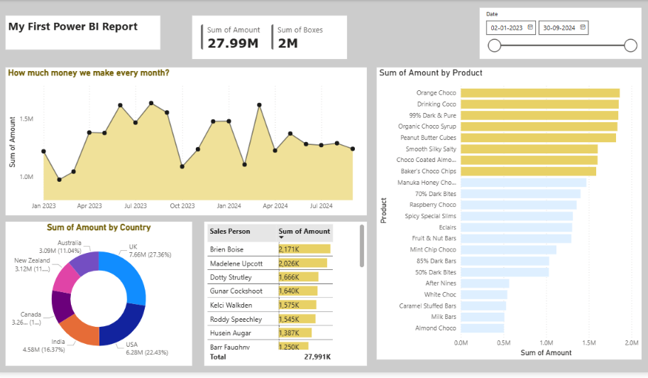

# 🍫 Chocolate Sales Dashboard (Power BI)

## 📌 Project Overview

This project is an interactive Power BI dashboard developed to analyze chocolate sales data. The dashboard provides valuable insights into sales performance, product trends, country-wise revenue distribution, and salesperson contributions through interactive visualizations.

## 🎯 Objectives

* Analyze overall sales performance.
* Identify top-performing products.
* Compare sales across different countries.
* Track salesperson performance.
* Monitor monthly sales trends.

## 📊 Dashboard Features

* Total Sales Amount KPI
* Total Boxes Sold KPI
* Monthly Sales Trend Analysis
* Product-wise Sales Performance
* Country-wise Revenue Analysis
* Salesperson Performance Tracking
* Interactive Date Filtering

## 🛠️ Tools Used

* Power BI
* Power Query
* Microsoft Excel

## 📈 Key Insights

* Generated sales insights from multiple countries.
* Identified top-performing products and salespersons.
* Analyzed monthly sales trends for better decision-making.
* Created an interactive dashboard for business reporting.

## 📷 Dashboard Preview

## 📂 Files Included

* Chocolate_Sales_project_PowerBI.pbix
* Dashboard.png
* sample-chocolate-sales-data.xlsx

## 🚀 Skills Demonstrated

* Data Cleaning
* Data Transformation
* Data Analysis
* Data Visualization
* Dashboard Development
* Business Intelligence Reporting

## 👨‍💻 Author

Karan Kumar Chauhan | B.Tech (Computer Science and Engineering - Data Science)
